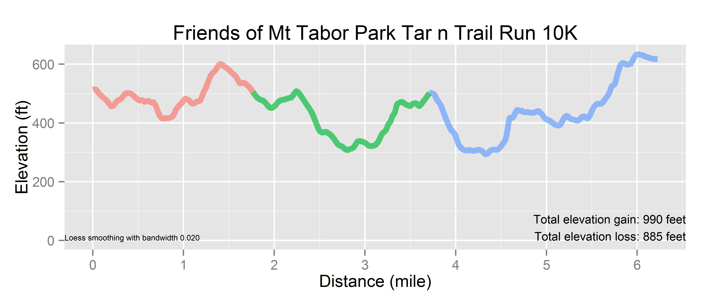

# Mt. Tabor Tar and Trail 10K
Benjamin Chan  

Course map for the [Friends of Mt Tabor Park Tar n Trail Run](http://www.runannie.net/).

2014-09-19 15:10:31

R version 3.1.1 (2014-07-10)


Load the GPX file.
The source of the GPX data was a Suunto Ambit 2R.
The data was recorded on 9/14/2014.


```r
require(plotKML, quietly=TRUE)
f <- file.path(getwd(), "Course preview- Mt Tabor Park Tar n Trail 10K.gpx")
D <- readGPX(f)
tracks <- D$tracks[[1]][[1]]
```

Find the geometric mean of the coordinates in the GPX file.


```r
require(geosphere, quietly=TRUE)
gmean <- geomean(tracks[, c("lon", "lat")])
gmean
```

```
##           x     y
## [1,] -122.6 45.51
```

Calculate distances.
Use the Haversine algorithm.


```r
require(geosphere, quietly=TRUE)
tracks$distIncremental <- 0
p1 <- tracks[1:nrow(tracks)-1, c("lon", "lat")]
p2 <- tracks[2:nrow(tracks), c("lon", "lat")]
tracks$distIncremental[2:nrow(tracks)] <- distHaversine(p1, p2) / 1000
tracks$distCumulative <- cumsum(tracks$distIncremental)
```

Convert distance from kilometers to miles.


```r
tracks$distCumulativeMiles <- tracks$distCumulative * 0.621371
```

Get mile markers for annotation.


```r
tracks$mile <- floor(tracks$distCumulativeMiles)
milePosts <- aggregate(time ~ mile, data=tracks, min)
milePosts <- merge(tracks, milePosts, by=c("time", "mile"))
milePosts <- milePosts[milePosts$mile > 0, ]
```

Convert elevation from meters to feet.


```r
tracks$ele <- as.numeric(tracks$ele) * 3.28084
```

Smooth the elevation data.
The bandwidth parameter was set using trial-and-error.
Use kernal smoothing instead of LOESS.


```r
smoothed <- ksmooth(tracks$distCumulativeMiles, tracks$ele, bandwidth=0.1)
tracks$eleSmoothed <- smoothed$y
# smoothed <- loess(ele ~ distCumulativeMiles, tracks, span=0.1)
# tracks$eleSmoothed <- predict(smoothed)
head(tracks)
```

```
##      lon   lat   ele                 time extensions distIncremental
## 1 -122.6 45.51 512.1 2014-09-14T15:16:36Z         92         0.00000
## 2 -122.6 45.51 513.8 2014-09-14T15:16:47Z         92         0.01280
## 3 -122.6 45.51 515.7 2014-09-14T15:16:52Z         93         0.01247
## 4 -122.6 45.51 517.4 2014-09-14T15:17:00Z         92         0.02583
## 5 -122.6 45.51 507.9 2014-09-14T15:17:08Z         93         0.02652
## 6 -122.6 45.51 501.6 2014-09-14T15:17:17Z         93         0.02619
##   distCumulative distCumulativeMiles mile eleSmoothed
## 1        0.00000            0.000000    0       513.4
## 2        0.01280            0.007952    0       513.4
## 3        0.02527            0.015703    0       511.4
## 4        0.05111            0.031755    0       509.6
## 5        0.07763            0.048235    0       506.8
## 6        0.10382            0.064512    0       501.1
```

Calculate elevation gain.


```r
tracks$eleChange <- NA
tracks$eleChange[2:nrow(tracks)] <- tracks$eleSmoothed[2:nrow(tracks)] - tracks$eleSmoothed[1:nrow(tracks)-1]
tracks$eleGain <- pmax(tracks$eleChange, 0)
tracks$eleLoss <- -pmin(tracks$eleChange, 0)
```

Print course statistics.


```r
message(sprintf("Total distance: %.2f kilometers\nTotal elevation gain: %.0f feet\nTotal elevation loss: %.0f feet",
                sum(tracks$distIncremental, na.rm=TRUE),
                sum(tracks$eleGain, na.rm=TRUE),
                sum(tracks$eleLoss, na.rm=TRUE)))
```

```
## Total distance: 10.02 kilometers
## Total elevation gain: 877 feet
## Total elevation loss: 774 feet
```

Create `trail` variable.


```r
tracks$trail <- cut(tracks$distCumulative, breaks=c(0, 2.85, 5.95, max(tracks$distCumulative)), labels=c("Red", "Green", "Blue"), include.lowest=TRUE)
```

Fix the discontinuity between trail transitions.


```r
transitions <- c(2.84, 5.97)
delta <- 0.025
continuity <- tracks[which(transitions - delta < tracks$distCumulative & tracks$distCumulative < transitions + delta), ]
continuity
```

```
##        lon   lat   ele                 time extensions distIncremental
## 151 -122.6 45.52 505.6 2014-09-14T15:34:32Z         84         0.01799
## 284 -122.6 45.52 501.6 2014-09-14T15:53:50Z         63         0.03736
##     distCumulative distCumulativeMiles mile eleSmoothed eleChange eleGain
## 151          2.841               1.765    1       460.1     3.281   3.281
## 284          5.975               3.713    3       481.8    -6.749   0.000
##     eleLoss trail
## 151   0.000   Red
## 284   6.749  Blue
```

```r
continuity$trail <- "Green"
continuity
```

```
##        lon   lat   ele                 time extensions distIncremental
## 151 -122.6 45.52 505.6 2014-09-14T15:34:32Z         84         0.01799
## 284 -122.6 45.52 501.6 2014-09-14T15:53:50Z         63         0.03736
##     distCumulative distCumulativeMiles mile eleSmoothed eleChange eleGain
## 151          2.841               1.765    1       460.1     3.281   3.281
## 284          5.975               3.713    3       481.8    -6.749   0.000
##     eleLoss trail
## 151   0.000 Green
## 284   6.749 Green
```

```r
tracks <- rbind(tracks, continuity)
tracks <- tracks[order(tracks$time), ]
```

Fix a stupid bug in get_map.
See [ggmap stamen watercolor png error](http://stackoverflow.com/a/24301510).
Shouldn't need to do this with ggmap 2.4.


```r
require(ggmap)
get_stamenmap <- function (bbox = c(left = -95.80204, bottom = 29.38048, right = -94.92313, 
    top = 30.14344), zoom = 10, maptype = c("terrain", "watercolor", 
    "toner"), crop = TRUE, messaging = FALSE, urlonly = FALSE, 
    filename = "ggmapTemp", color = c("color", "bw"), ...) 
{
    require(jpeg)
    args <- as.list(match.call(expand.dots = TRUE)[-1])
    argsgiven <- names(args)
    if ("bbox" %in% argsgiven) {
        if (!(is.numeric(bbox) && length(bbox) == 4)) {
            stop("bounding box improperly specified.  see ?get_openstreetmap", 
                call. = F)
        }
    }
    if ("zoom" %in% argsgiven) {
        if (!(is.numeric(zoom) && length(zoom) == 1 && zoom == 
            round(zoom) && zoom >= 0 && zoom <= 18)) {
            stop("scale must be a postive integer 0-18, see ?get_stamenmap.", 
                call. = F)
        }
    }
    if ("messaging" %in% argsgiven) 
        stopifnot(is.logical(messaging))
    if ("urlonly" %in% argsgiven) 
        stopifnot(is.logical(urlonly))
    if ("filename" %in% argsgiven) {
        filename_stop <- TRUE
        if (is.character(filename) && length(filename) == 1) 
            filename_stop <- FALSE
        if (filename_stop) 
            stop("improper filename specification, see ?get_stamenmap.", 
                call. = F)
    }
    if ("checkargs" %in% argsgiven) {
        .Deprecated(msg = "checkargs argument deprecated, args are always checked after v2.1.")
    }
    maptype <- match.arg(maptype)
    color <- match.arg(color)
    if (is.null(names(bbox))) 
        names(bbox) <- c("left", "bottom", "right", "top")
    fourCorners <- expand.grid(lon = c(bbox["left"], bbox["right"]), 
        lat = c(bbox["bottom"], bbox["top"]))
    fourCorners$zoom <- zoom
    row.names(fourCorners) <- c("lowerleft", "lowerright", "upperleft", 
        "upperright")
    fourCornersTiles <- apply(fourCorners, 1, function(v) LonLat2XY(v[1], 
        v[2], v[3]))
    xsNeeded <- Reduce(":", sort(unique(as.numeric(sapply(fourCornersTiles, 
        function(df) df$X)))))
    numXTiles <- length(xsNeeded)
    ysNeeded <- Reduce(":", sort(unique(as.numeric(sapply(fourCornersTiles, 
        function(df) df$Y)))))
    numYTiles <- length(ysNeeded)
    tilesNeeded <- expand.grid(x = xsNeeded, y = ysNeeded)
    if (nrow(tilesNeeded) > 40) {
        message(paste0(nrow(tilesNeeded), " tiles needed, this may take a while ", 
            "(try a smaller zoom)."))
    }
    xTileProgression <- rep(1:numXTiles, numYTiles)
    yTileProgression <- rep(1:numYTiles, each = numXTiles)
    base_url <- "http://tile.stamen.com/"
    base_url <- paste(base_url, maptype, "/", zoom, sep = "")
    urls <- paste(base_url, apply(tilesNeeded, 1, paste, collapse = "/"), 
        sep = "/")
    urls <- paste(urls, ".jpg", sep = "")
    if (messaging) 
        message(length(urls), " tiles required.")
    if (urlonly) 
        return(urls)
    size <- 256 * c(length(xsNeeded), length(ysNeeded))
    map <- matrix("NA", nrow = size[2], ncol = size[1])
    destfile <- paste(filename, "jpg", sep = ".")
    for (k in seq_along(urls)) {
        download.file(urls[[k]], destfile = destfile, quiet = !messaging, 
            mode = "wb")
        tile <- readJPEG(destfile)
        if (color == "color") {
            tile <- apply(tile, 2, rgb)
        }
        else if (color == "bw") {
            tile_dim <- dim(tile)
            tile <- gray(0.3 * tile[, , 1] + 0.59 * tile[, , 
                2] + 0.11 * tile[, , 3])
            dim(tile) <- tile_dim[1:2]
        }
        map[(1 + 256 * (yTileProgression[k] - 1)):(256 * yTileProgression[k]), 
            (1 + 256 * (xTileProgression[k] - 1)):(256 * xTileProgression[k])] <- tile
    }
    bboxOfTile <- function(vXY) {
        lonlat_upperleft <- XY2LonLat(vXY[1], vXY[2], zoom)
        lonlat_lowerright <- XY2LonLat(vXY[1] + 1, vXY[2] + 1, 
            zoom)
        data.frame(left = lonlat_upperleft$lon, bottom = lonlat_lowerright$lat, 
            right = lonlat_lowerright$lon, top = lonlat_upperleft$lat)
    }
    tileBboxes <- ldply(split(tilesNeeded, 1:nrow(tilesNeeded)), 
        function(df) bboxOfTile(as.numeric(df)))
    mbbox <- c(left = min(tileBboxes$left), bottom = min(tileBboxes$bottom), 
        right = max(tileBboxes$right), top = max(tileBboxes$top))
    if (!crop) {
        map <- as.raster(map)
        class(map) <- c("ggmap", "raster")
        attr(map, "bb") <- data.frame(ll.lat = mbbox["bottom"], 
            ll.lon = mbbox["left"], ur.lat = mbbox["top"], ur.lon = mbbox["right"])
        return(map)
    }
    if (crop) {
        slon <- seq(mbbox["left"], mbbox["right"], length.out = size[1])
        slat <- seq(mbbox["top"], mbbox["bottom"], length.out = size[2])
        keep_x_ndcs <- which(bbox["left"] <= slon & slon <= bbox["right"])
        keep_y_ndcs <- which(bbox["bottom"] <= slat & slat <= 
            bbox["top"])
        croppedmap <- map[keep_y_ndcs, keep_x_ndcs]
    }
    croppedmap <- as.raster(croppedmap)
    class(croppedmap) <- c("ggmap", "raster")
    attr(croppedmap, "bb") <- data.frame(ll.lat = bbox["bottom"], 
        ll.lon = bbox["left"], ur.lat = bbox["top"], ur.lon = bbox["right"])
    croppedmap
}
require(jpeg)
require(plyr)
assignInNamespace("get_stamenmap", get_stamenmap, ns="ggmap")
```

Get map layer.


```r
mapTabor <- get_map(location=gmean, maptype="terrain", source="stamen", zoom=16)
```

```
## Map from URL : http://maps.googleapis.com/maps/api/staticmap?center=45.512117,-122.595166&zoom=16&size=%20640x640&maptype=terrain&sensor=false
## Google Maps API Terms of Service : http://developers.google.com/maps/terms
```

Course map.


```r
ggmap(mapTabor, base_layer=ggplot(tracks, aes(x=lon, y=lat, color=trail))) +
  geom_path(alpha=2/3, size=2) +
  annotate("text", label="Start", x=tracks[1, "lon"], y=tracks[1, "lat"]) +
  annotate("text", label="Finish", x=tracks[nrow(tracks), "lon"], y=tracks[nrow(tracks), "lat"]) +
  annotate("text", label=milePosts[, "mile"], x=milePosts[, "lon"], y=milePosts[, "lat"]) +
  scale_color_discrete("Trail") +
  labs(title="Friends of Mt Tabor Park Tar n Trail Run 10K") +
  theme(axis.text=element_blank(), axis.title=element_blank(), axis.ticks=element_blank())
```

 

Elevation chart.


```r
a1 <- sprintf("Total elevation gain: %.0f feet\nTotal elevation loss: %.0f feet",
              sum(tracks$eleGain, na.rm=TRUE),
              sum(tracks$eleLoss, na.rm=TRUE))
ggplot(tracks, aes(x=distCumulativeMiles, y=eleSmoothed, color=trail)) +
  geom_line(alpha=2/3, size=2) +
  scale_x_continuous("Distance (mile)", breaks=c(seq(0, 6))) +
  scale_y_continuous("Elevation (ft)", limits=c(0, max(tracks$ele))) +
  scale_color_discrete("Trail") +
  annotate("text", label=a1, x=Inf, y=0, hjust=1, vjust=0) +
  labs(title="Friends of Mt Tabor Park Tar n Trail Run 10K")
```

 
